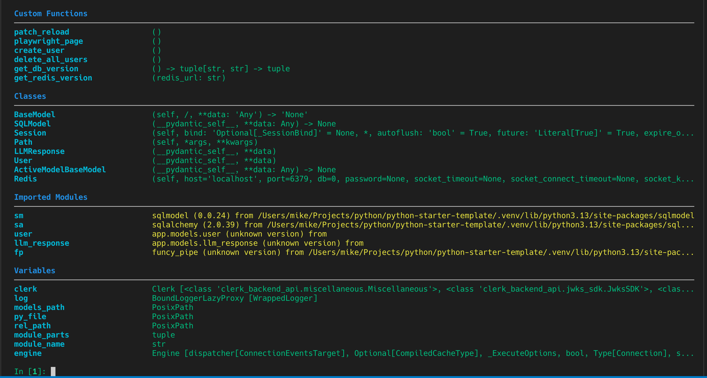

[](https://github.com/iloveitaly/ipython-playground/releases)
[](https://pepy.tech/project/ipython-playground)

[](https://opensource.org/licenses/MIT)

# IPython Playground

I'm a big fan of playgrounds. Every repo should have a `playground.py` to make it easy to jump right
into REPL-driven development.

However, it's hard to understand what's in the `playground.py` once it gets big. This project eliminates this problem ([example from this project](https://github.com/iloveitaly/python-starter-template)):



## Installation

```bash
uv add ipython-playground
```

## Usage

1. Run `ipython-playground` to generate a `playground.py`.  
2. Execute `./playground.py` to start an IPython session with additional setup.

## How `extras.py` and the `all()` hook work

The `ipython_playground/extras.py` file provides logic to automatically import and expose useful modules and objects in your playground session. The main entry point is the `all()` function, which:

- Loads common app modules (like `app.models`, `app.commands`, `app.jobs`) if available.
- Attempts to import helpful libraries such as `funcy_pipe`, `sqlalchemy`, and `sqlmodel`.
- Optionally discovers all SQLModel classes in your models module and adds them to the namespace.
- If a database URL is available (either passed in or imported from your app config), sets up a SQLAlchemy engine and session, and exposes helpers for running and compiling SQL statements.

When you run `playground.py`, it calls `globals().update(ipython_playground.all_extras())`, which injects all these objects into your interactive session, making them immediately available for experimentation.

---

*This project was created from [iloveitaly/python-package-template](https://github.com/iloveitaly/python-package-template)*
